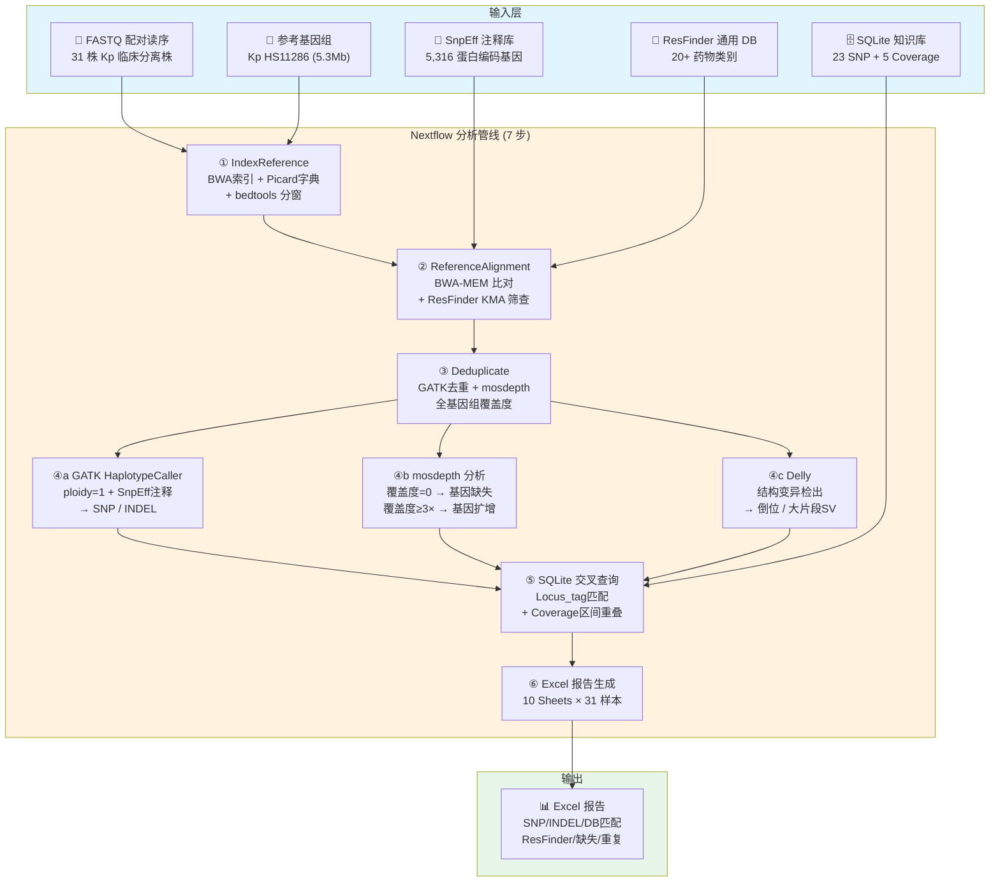
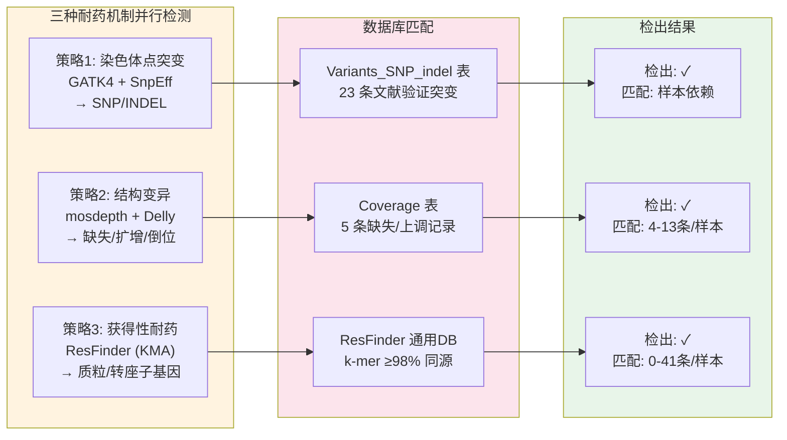
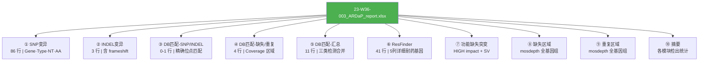
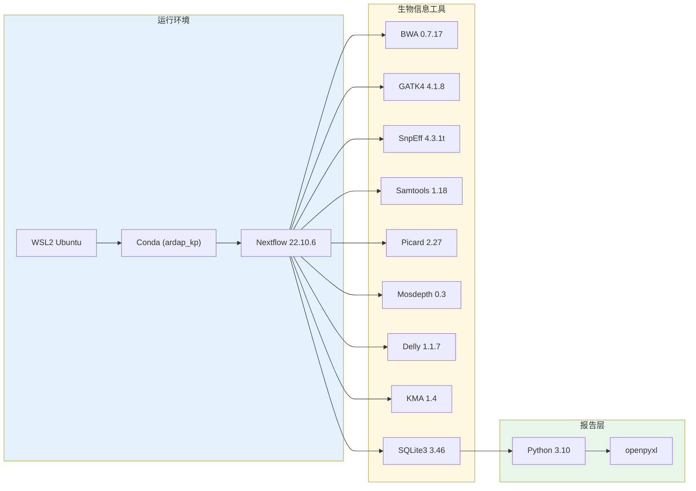

# Kp-ARDaP Pipeline (Mermaid 流程图)

## 总览 — 复制到支持 Mermaid 的 Markdown 渲染器（GitHub / VS Code / Typora）

```mermaid
flowchart TD
    subgraph INPUT["输入层"]
        FASTQ["🧬 FASTQ 配对读序<br/>31 株 Kp 临床分离株"]
        REF["📖 参考基因组<br/>Kp HS11286 (5.3Mb)"]
        DB["🗄️ SQLite 知识库<br/>23 SNP + 5 Coverage"]
        RESF["🧪 ResFinder 通用 DB<br/>20+ 药物类别"]
        SNPEFF["📝 SnpEff 注释库<br/>5,316 蛋白编码基因"]
    end

    subgraph PIPELINE["Nextflow 分析管线 (7 步)"]
        S1["① IndexReference<br/>BWA索引 + Picard字典<br/>+ bedtools 分窗"]
        S2["② ReferenceAlignment<br/>BWA-MEM 比对<br/>+ ResFinder KMA 筛查"]
        S3["③ Deduplicate<br/>GATK去重 + mosdepth<br/>全基因组覆盖度"]
        S4A["④a GATK HaplotypeCaller<br/>ploidy=1 + SnpEff注释<br/>→ SNP / INDEL"]
        S4B["④b mosdepth 分析<br/>覆盖度=0 → 基因缺失<br/>覆盖度≥3× → 基因扩增"]
        S4C["④c Delly<br/>结构变异检出<br/>→ 倒位 / 大片段SV"]
        S5["⑤ SQLite 交叉查询<br/>Locus_tag匹配<br/>+ Coverage区间重叠"]
        S6["⑥ Excel 报告生成<br/>10 Sheets × 31 样本"]
    end

    subgraph OUTPUT["输出"]
        EXCEL["📊 Excel 报告<br/>SNP/INDEL/DB匹配<br/>ResFinder/缺失/重复"]
    end

    FASTQ --> S1
    REF --> S1
    S1 --> S2
    SNPEFF --> S2
    RESF --> S2
    S2 --> S3
    S3 --> S4A
    S3 --> S4B
    S3 --> S4C
    S4A --> S5
    S4B --> S5
    S4C --> S5
    DB --> S5
    S5 --> S6
    S6 --> EXCEL

    style INPUT fill:#e1f5fe
    style PIPELINE fill:#fff3e0
    style OUTPUT fill:#e8f5e9
```

## 三路并行检测

```mermaid
flowchart LR
    subgraph DETECT["三种耐药机制并行检测"]
        direction TB
        S1["策略1: 染色体点突变<br/>GATK4 + SnpEff<br/>→ SNP/INDEL"]
        S2["策略2: 结构变异<br/>mosdepth + Delly<br/>→ 缺失/扩增/倒位"]
        S3["策略3: 获得性耐药<br/>ResFinder (KMA)<br/>→ 质粒/转座子基因"]
    end
    
    subgraph MATCH["数据库匹配"]
        M1["Variants_SNP_indel 表<br/>23 条文献验证突变"]
        M2["Coverage 表<br/>5 条缺失/上调记录"]
        M3["ResFinder 通用DB<br/>k-mer ≥98% 同源"]
    end
    
    subgraph RESULT["检出结果"]
        R1["检出: ✓<br/>匹配: 样本依赖"]
        R2["检出: ✓<br/>匹配: 4-13条/样本"]
        R3["检出: ✓<br/>匹配: 0-41条/样本"]
    end
    
    S1 --> M1 --> R1
    S2 --> M2 --> R2
    S3 --> M3 --> R3
    
    style DETECT fill:#fff3e0
    style MATCH fill:#fce4ec
    style RESULT fill:#e8f5e9
```

## Excel 报告结构

```mermaid
flowchart TD
    XLS["23-W36-003_ARDaP_report.xlsx"]
    XLS --> SH1["① SNP变异<br/>86 行 | Gene·Type·NT·AA"]
    XLS --> SH2["② INDEL变异<br/>3 行 | 含 frameshift"]
    XLS --> SH3["③ DB匹配-SNP/INDEL<br/>0-1 行 | 精确位点匹配"]
    XLS --> SH4["④ DB匹配-缺失/重复<br/>4 行 | Coverage 区域"]
    XLS --> SH5["⑤ DB匹配-汇总<br/>11 行 | 三类检测合并"]
    XLS --> SH6["⑥ ResFinder<br/>41 行 | 5列详细耐药基因"]
    XLS --> SH7["⑦ 功能缺失突变<br/>HIGH impact + SV"]
    XLS --> SH8["⑧ 缺失区域<br/>mosdepth 全基因组"]
    XLS --> SH9["⑨ 重复区域<br/>mosdepth 全基因组"]
    XLS --> SH10["⑩ 摘要<br/>各模块检出统计"]
    
    style XLS fill:#4caf50,color:#fff
```

## 技术栈

```mermaid
flowchart LR
    subgraph INFRA["运行环境"]
        WSL["WSL2 Ubuntu"]
        CONDA["Conda (ardap_kp)"]
        NF["Nextflow 22.10.6"]
    end
    
    subgraph TOOLS["生物信息工具"]
        BWA["BWA 0.7.17"]
        GATK["GATK4 4.1.8"]
        SNPEFF["SnpEff 4.3.1t"]
        SAM["Samtools 1.18"]
        PICARD["Picard 2.27"]
        MOS["Mosdepth 0.3"]
        DELLY["Delly 1.1.7"]
        KMA["KMA 1.4"]
        SQL["SQLite3 3.46"]
    end
    
    subgraph REPORT["报告层"]
        PY["Python 3.10"]
        OXL["openpyxl"]
    end
    
    WSL --> CONDA --> NF
    NF --> BWA & GATK & SNPEFF & SAM & PICARD & MOS & DELLY & KMA & SQL
    SQL --> PY --> OXL
    
    style INFRA fill:#e3f2fd
    style TOOLS fill:#fff8e1
    style REPORT fill:#e8f5e9
```
